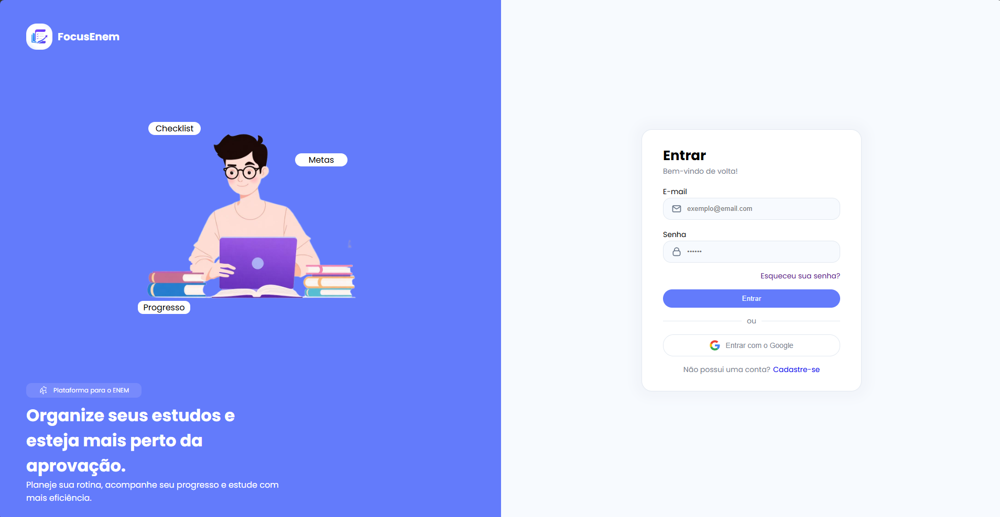
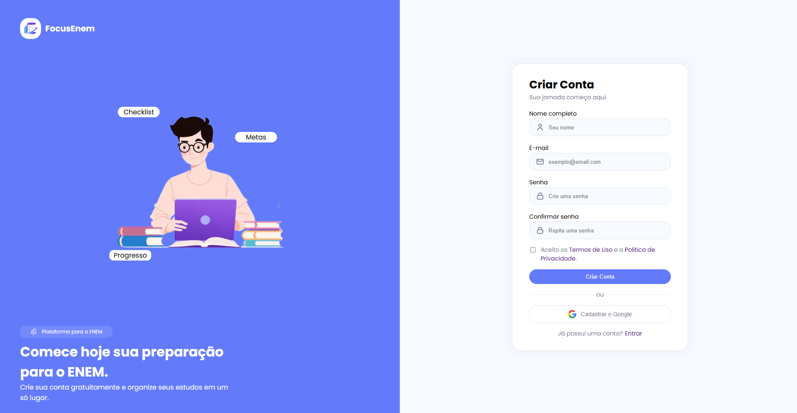
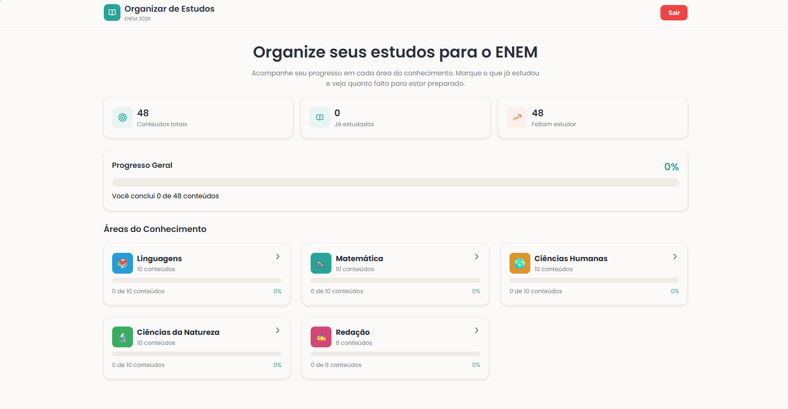
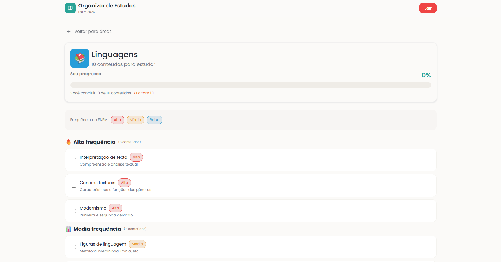

# 🎯 ENEM Focus

O **ENEM Focus** é uma plataforma web desenvolvida para auxiliar estudantes na preparação para o ENEM, oferecendo uma experiência de estudos organizada, personalizada e focada na evolução do aluno.

## ✨ Funcionalidades

- 📚 Organização de conteúdos por matéria
- ✅ Controle de progresso dos estudos
- 📊 Dashboard com estatísticas de desempenho
- 🎯 Acompanhamento da evolução
- 🔐 Sistema de autenticação de usuários
- ☁️ Banco de dados em PostgreSQL (Supabase)
- 📱 Interface responsiva

## 🚀 Tecnologias Utilizadas

### Front-end
- HTML5
- CSS3
- JavaScript

### Back-end
- Python
- Flask
- SQLAlchemy

### Banco de Dados
- PostgreSQL
- Supabase

### Deploy
- Vercel

## 📷 Demonstração

Acesse a plataforma:

👉 [https://enem-focus-pied.vercel.app](https://enem-focus-pied.vercel.app/)

> Caso a aplicação esteja temporariamente em manutenção ou recebendo atualizações, algumas funcionalidades podem ficar indisponíveis.

## 📸 Capturas de Tela

### Login

### Cadastro

### Matérias

### Matéria

## 🗺️ Roadmap

- [x] Sistema de autenticação
- [x] Dashboard de estudos
- [x] Controle de progresso
- [x] Banco de dados PostgreSQL
- [x] Deploy na Vercel
- [ ] Login com Google
- [ ] Recuperação de senha
- [ ] Simulados personalizados
- [ ] Flashcards
- [ ] Modo escuro

## 🔒 Código-fonte

Este repositório tem como objetivo apresentar o projeto e suas funcionalidades.

O código-fonte é mantido em um repositório privado devido ao desenvolvimento contínuo e aos planos futuros para a plataforma.

## 👨‍💻 Desenvolvedor

**José Satiro**

Estudante de Informática no IFCE e desenvolvedor Full Stack, apaixonado por criar soluções que utilizam tecnologia para facilitar o aprendizado.

---

⭐ Caso tenha interesse em conhecer mais projetos, acompanhe meu perfil no GitHub.
